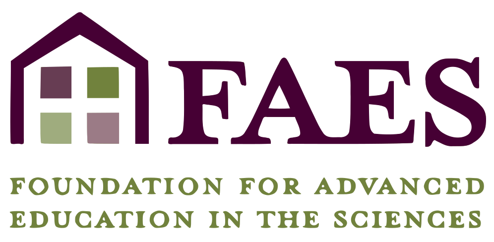

::: {custom-style="center"}
{height="2cm"}

Course Identification Number and Title

Number of Credits

Term and Year

Syllabus
:::

# Instructor: \_\_\_\_ \_\_\_\_

# Contact Information:

## E-mail: \_\_\_\_@gmail.com

## Phone: \_\_\_\_-\_\_\_\_-\_\_\_\_

## Virtual Office Hours: \_\_\_\_days, \_\_:\_\_-\_\_:\_\_

## Preferred Method of Communication: https://gitter.im/\_\_\_\_/community

# Course Information:

## Prerequisites: None

## Course Description:

### Describe your course here

## Course Website:

### Explanation for how, and how frequently, to access the course site

## Learning Materials:

### Required and Recommended Texts:

### Required Journal Articles:

#### Explanation for how to access these articles

## Course Goals

### When you complete the course successfully, you will be able to:

#### \[Add the goals here\]

## Structure of the Course

### Organization of the course

### The Learning Process

#### Your teaching and learning philosophy

#### Methods for students to achieve success

#### Time commitment

# Important Dates:

## Drop deadline

## Audit and withdrawal deadline

## Holidays

# Communication:

## Reply to email:

## Reply to voicemail:

## Preferred time to call:

## Other forms of communication, if applicable:

# Etiquette:

## Email:

## Group etiquette:

## Discussion board etiquette:

**\[PLEASE DO NOT CHANGE OR DELETE THE TEXT BELOW THROUGH THE \*\*\*\]**

# Policies:

## Academic Policies:

### This course adheres to all FAES policies described in the academic catalog and student handbook, including the Academic Integrity policy listed on page 11 of the academic catalog and student handbook. Be certain that you are knowledgeable about all of the policies listed in this syllabus, in the academic catalog and student handbook, and on the FAES website. As a student in this program, you are bound by those policies.

## Copyright:

### All course materials are the property of FAES and are to be used for the student’s individual academic purpose only. Any dissemination, copying, reproducing, modification, displaying, or transmitting of any course material for any other purpose is prohibited, will be considered misconduct, and may be cause for disciplinary action. In addition, encouraging academic dishonesty by distributing information about course materials or assignments which would give an unfair advantage to others may violate the FAES Academic Integrity policy. Course materials may not be exchanged or distributed for commercial purposes, for compensation, or for any purpose other than use by students enrolled in the course. Distributions of course materials may be subject to disciplinary action.

## Guidelines for Disability Accommodations:

### FAES is committed to providing reasonable and appropriate accommodations to students with disabilities. Students with documented disabilities should contact Dr. Mindy Maris, Assistant Dean of Academic Programs.

## Dropping the Course:

### Students are responsible for understanding FAES policies, procedures, and deadlines regarding dropping or withdrawing from the course or switching to audit status.

## Harassment:

### FAES adheres to the NIH’s harassment policies, which can be found at the following link: <https://hr.nih.gov/working-nih/civil/statement-workplace-harassment>

### Faculty and students in FAES courses are responsible for being familiar with the NIH’s harassment policies and adhering to them.

**\[\*\*\*\]**

\[INCLUDE LANGUAGE ABOUT YOUR OWN POLICIES REGARDING THE FOLLOWING:\]

## Attendance

## Participation

## Assignment Submission

## Due Dates

## Late Submission Policies

## Assignment Formats

## Citation Format

## Discussion Board Policies, if applicable:

### Guidelines for posts

### Due dates

### Late submission policies

# Assignments:

## Step-by-Step Guidelines for Submitting Assignments:

## Expectations for instructor’s feedback on assignments:

## Major Assignments:

### Detailed assignment descriptions

### Value of each assignment / percentage of total course grade

# Grading Scale:

# Weekly Schedule:

  Week   Readings   Learning Activities and Assignments
  ------ ---------- -------------------------------------
  1                 
  2                 
  3                 
  4                 
  5                 
  6                 
  7                 
  8                 
  9                 
  10                
  11                
  12                
  13                
  14                

  : Course Schedule

